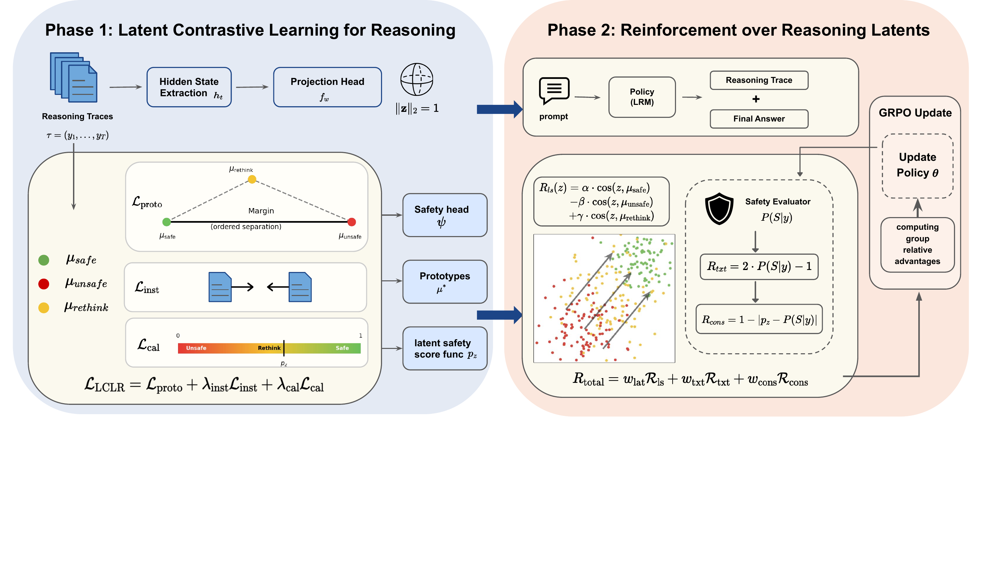

# CRAFT: Contrastive Reasoning Alignment: Reinforcement Learning from Hidden Representations

[](https://icml.cc)
[](https://arxiv.org/abs/2603.17305)
[](LICENSE)

The repo contains:
1. **Official Implementation**
  The official implementation of [Contrastive Reasoning Alignment: Reinforcement Learning from Hidden Representations](https://arxiv.org/abs/2603.17305).
2. **LCLR Code**
  Structures the model's latent space by pulling safe and unsafe reasoning traces apart using a contrastive objective over hidden states.
3. **GRPO Code**
  Fine-tunes the model with GRPO using a three-part latent-aware reward that penalizes unsafe thinking mid-reasoning, not just unsafe final outputs.
4. **Visualization Code**
  Generates plots of the learned latent space (e.g., t-SNE/PCA projections of safe vs. unsafe reasoning trace embeddings) to qualitatively verify the separation achieved by LCLR.

## Introduction
CRAFT is a two-phase alignment framework that mitigates *superficial safety alignment* (SSA) in large reasoning models. Rather than operating at the output level, CRAFT (1) structures the latent space of reasoning traces via contrastive learning (LCLR), and (2) applies GRPO with a latent-aware reward that aligns intermediate reasoning states with the final response (R²L).



## Key Results

| Metric | Improvement over base model |
| --- | --- |
| Reasoning-trace safety | **+82.1%** (avg across models) |
| Final-response safety | **+89.6%** (avg across models) |
| Reasoning ability (math + code) | **+8.0%** (avg across models) |

Evaluated on DeepSeek-R1-Distill-Llama-8B and Qwen3-4B-Thinking across JailbreakBench, StrongReject, AIME24, MATH-500, Minerva, and LiveCodeBench. Full tables and reproduction steps: [`docs/reproducibility.md`](docs/reproducibility.md).

## Repository Layout

```
CRAFT/
├── config.yaml                    # Fill in your credentials/paths (gitignored)
├── requirements.txt               # Top-level dependencies
│
├── src/
│   ├── lclr/                      # Phase 1: Latent Contrastive Learning for Reasoning
│   │   ├── train_lca.py           # LCLR training entry point
│   │   ├── evaluate_lca.py        # Evaluation of learned heads
│   │   ├── lca.py                 # ProjectionHead, SafetyHead, training loop
│   │   └── requirements.txt
│   │
│   └── r2l/                       # Phase 2: Reinforcement over Reasoning Latents
│       ├── examples/
│       │   ├── scripts/
│       │   │   ├── train_qwen3_4b_thinking.sh   # Main training script
│       │   │   └── train_ablation.sh             # Table 3 ablation
│       │   ├── configs/
│       │   │   ├── config_qwen3_4b_thinking.yaml # Main config
│       │   │   └── config_ablation.yaml          # Ablation config (Table 3)
│       │   └── reward_function/
│       │       ├── reasoning_trace.py            # CRAFT reward (R_lat + R_txt + R_cons)
│       │       └── reasoning_trace_ablation.py   # Ablation reward (config-driven weights)
│       ├── verl/                  # Modified EasyR1/veRL GRPO trainer
│       └── Dockerfile
│
├── eval/
│   ├── jailbreakbench/
│   │   ├── jbb_qwen.py            # JailbreakBench inference + scoring
│   │   └── jbb_qwen.sh            # Launcher (reads config.yaml)
│   ├── strongreject/              # Vendored StrongReject autograder
│   └── advanced_attacks.md        # GPTFuzzer and AutoDAN pointers
│
└── docs/
    ├── figures/
    └── reproducibility.md         # Per-table reproduction commands
```

## Setup

### Option A — Conda

```bash
conda create -n craft python=3.10 -y && conda activate craft
pip install -r requirements.txt
pip install -r src/lclr/requirements.txt
pip install -e src/r2l   # installs the modified veRL trainer
```

### Option B — Docker (R²L training only)

```bash
docker build -t craft src/r2l
docker run --gpus all -it craft bash
```

The Docker image is based on `nvcr.io/nvidia/pytorch:25.05-py3` (CUDA 12.9).

### Credentials and paths

Copy and fill in `config.yaml` at the repo root before running evaluation:

```yaml
credentials:
  openai_api_key: ""        # GPT-based JBB judge
  huggingface_token: ""     # For gated HF models (optional)

paths:
  craft_model: "./checkpoints/qwen3_4b_thinking_craft"
  lclr_dir: "./outputs/lclr"
  eval_output: "./outputs/eval"
```

You also need a Hugging Face account (`huggingface-cli login`) to download base models and the `chuhac/R2D-R1` dataset.

## Reproducing the Paper

```bash
# Phase 1 — Train LCLR heads (~30 min, 1× A100 40GB)
cd src/lclr && python train_lca.py \
  --data_path chuhac/R2D-R1 \
  --model_name Qwen/Qwen3-4B-Thinking-2507 \
  --output_dir ../../outputs/lclr

# Phase 2 — R²L training (~14h, 4× A100 80GB)
bash src/r2l/examples/scripts/train_qwen3_4b_thinking.sh

# Evaluation — JailbreakBench
bash eval/jailbreakbench/jbb_qwen.sh
```

See [`docs/reproducibility.md`](docs/reproducibility.md) for hardware details, random seeds, and all per-table commands.

## Citation
If you have any question regarding our paper or codes, please feel free to start an issue.

If you use CRAFT in your work, please kindly cite our paper:

```bibtex
@inproceedings{luo2026craft,
  title     = {Contrastive Reasoning Alignment: Reinforcement Learning from Hidden Representations},
  author    = {Luo, Haozheng and Wang, Yimin and Yu, Jiahao and Wang, Binghui and Chen, Yan},
  booktitle = {Proceedings of the 43rd International Conference on Machine Learning},
  year      = {2026},
  series    = {PMLR},
  volume    = {306},
}
```

## License

Apache-2.0 (see [`LICENSE`](LICENSE)). CRAFT builds on [EasyR1](https://github.com/hiyouga/EasyR1) / [veRL](https://github.com/volcengine/verl) (Apache-2.0) — see [`NOTICE`](NOTICE) for full attributions.

## Acknowledgement
We appreciate the following GitHub repos a lot for their valuable code and efforts.
- EasyR1 (https://github.com/hiyouga/EasyR1)
- veRL (https://github.com/volcengine/verl)
- FROST (https://github.com/robinzixuan/FROST)
- EM_PT (https://github.com/shivamag125/EM_PT)
- BOOST (https://github.com/robinzixuan/XLLM)
- vLLM (https://github.com/vllm-project/vllm)
- StrongReject (https://github.com/dsbowen/strong_reject)

## Contact

Correspondence to Haozheng Luo (`hluo@u.northwestern.edu`).
